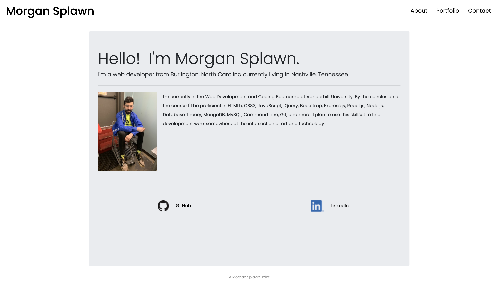
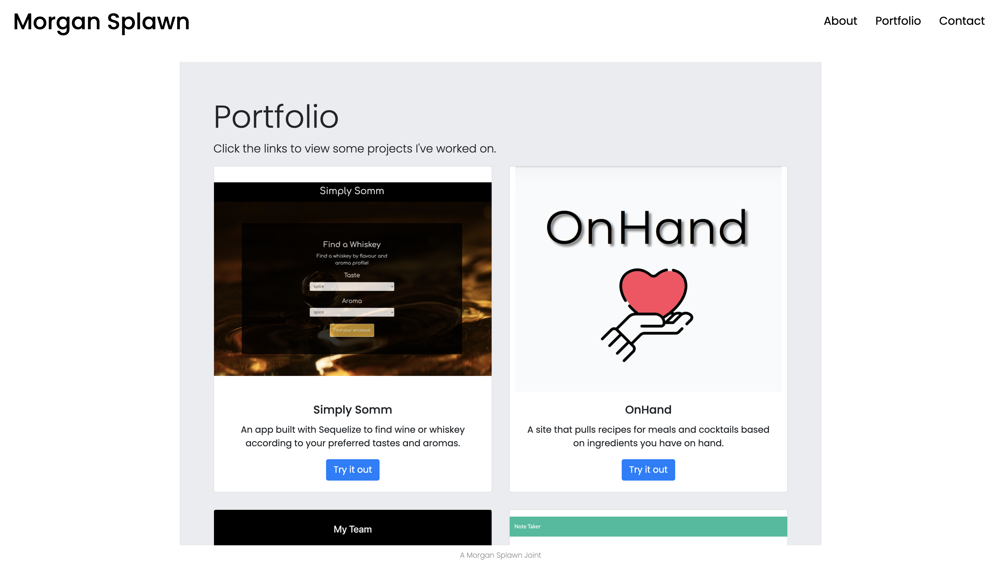
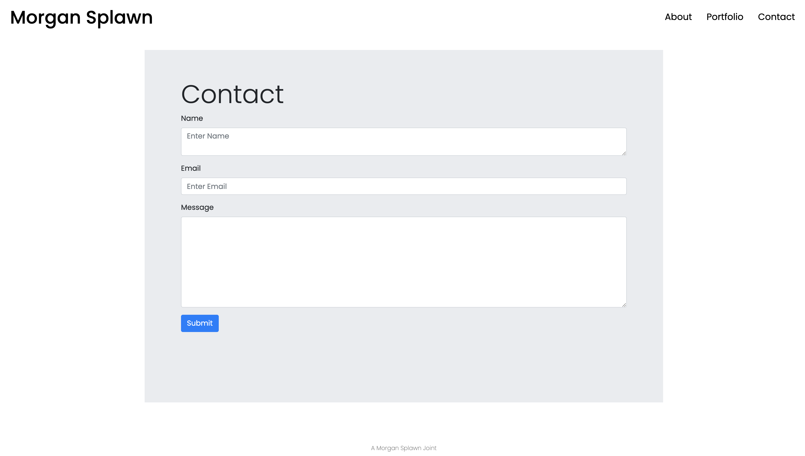

# About Me Site

## **Live Link**
[https://msplawn.github.io/bootstrap-about-me/]

# **Screen Shots**

## **Contributors**
@msplawn

# **Project Description**
For this project I created a 3 page website about myself using Bootstrap. My goal was to create a navigation bar and a responsive layout compatible on all sized viewports. I wanted to achieve this with minimal use of media queries. I also tried to utilize Bootstrap's row & column system efficiently.

# **Usage**
The site's purpose is threefold. The index is meant to tell possible employers and clients who I am and show them how strikingly handsome I am. The portfolio page is to provide an clean and organized space to view various projects I've worked on. The contact page is a form for people to reach out to me via email. 

# **Technology Stack**
* HTML 
* CSS
* Bootstrap
* Javascript
* Media Query

# **Contact**
* ### **Name:**  Morgan Splawn @msplawn
* ### **Email:**  [mmsplawn@gmail.com](msplawn@gmail.com)
* ### **LinkedIn:**  [https://www.linkedin.com/in/morgan-splawn-72979a1a9/](https://www.linkedin.com/in/morgan-splawn-72979a1a9/)

